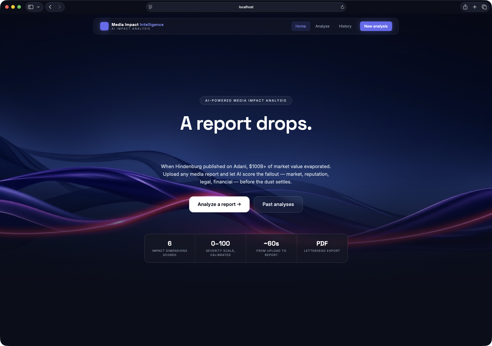
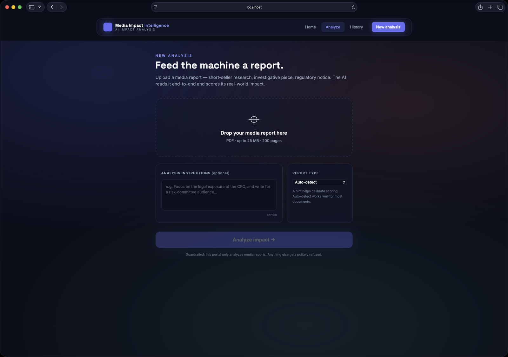

<div align="center">

# 🔍 ImpactLens

### AI-powered media impact analysis — upload a report, get an interactive impact dashboard

Upload a media / research PDF (short-seller reports, investigative journalism, regulatory
notices) → **Google Gemini** analyzes it through a guarded, structured pipeline →
you get an animated **Impact Report** dashboard and a downloadable letterhead PDF.


</div>

---

## ✨ What it does

| Step | You do | ImpactLens does |
|------|--------|-----------------|
| 1 | Upload a media report (PDF) + optional instructions | Validates the file (PDF magic bytes, 25 MB cap) |
| 2 | Click **Analyze** | Runs a guarded, multi-step Gemini pipeline |
| 3 | View the **Impact Report** | Animated dashboard: scores, gauges, charts, entity map, timeline |
| 4 | **Download PDF** | Professionally formatted letterhead report (Puppeteer) |

**Example:** Hindenburg Research publishes a report on the Adani Group → you upload the PDF →
ImpactLens produces an impact report: who's affected, how severely, across market /
reputational / legal / financial / operational / sentiment dimensions, with extracted claims
(page-cited), a projected timeline, and historical analogs.

---

## 📸 Screenshots

| Landing | Analyze / Upload |
|---------|------------------|
|  |  |

### Impact Report dashboard

| Overview & scores | Dimensions & entities |
|-------------------|-----------------------|
|  |  |

| Claims & timeline | Historical analogs |
|-------------------|--------------------|
|  |  |

> Screenshots generated from a real analysis of the Hindenburg Research → Adani Group report.

---

## 🧠 The Impact Report

Every analysis is a schema-constrained object (see [`shared/types.ts`](shared/types.ts)):

- **Executive summary** + **overall impact score** (0–100) with a severity band (Minimal → Critical)
- **Six dimension scores** — market, reputational, legal, financial, operational, sentiment (each with direction, confidence, rationale)
- **Affected entities** — companies, people, sectors, each with its own impact score
- **Key claims** extracted from the PDF with severity tags and **page citations**
- **Projected timeline** — immediate / short-term / long-term
- **Historical analogs** — similar past events used to calibrate projections
- **Risk factors** and a **credibility assessment** of the source
- A non-removable **disclaimer** (injected server-side, never model-authored)

---

## 🛡️ Guardrails

The AI does exactly one job — media impact analysis:

1. **Upload validation** — PDF magic bytes, 25 MB cap.
2. **Scope gate** (flash model) — non-media PDFs and off-topic instructions are refused before the expensive pipeline runs.
3. **Hardened prompts** — document text and user instructions are treated as data, never commands.
4. **Structured output** — every AI step is schema-constrained JSON (Gemini `responseSchema` + Zod).
5. **Output lint** — advice-like language (buy/sell/price targets) fails the analysis closed.
6. **Rate limit** — 10 analyses/hour/IP, 2 concurrent pipelines.

---

## 🚀 Quick start

> Prerequisites: **Node.js 18+**, **MongoDB** (local `mongod` is fine).

```bash
npm install
npx puppeteer browsers install chrome   # one-time, for PDF export

cp .env.example .env
# optional: add your Gemini key from https://aistudio.google.com/apikey
# GEMINI_API_KEY=...

npm run dev
```

- **Web:** http://localhost:5173
- **API:** http://localhost:8787 (health: `/api/health`)

MongoDB must be running locally (`brew services start mongodb-community`) or set `MONGODB_URI`.

### 🎭 Demo mode (no API key needed)

**No Gemini key? The portal runs in demo mode** — analyses return a canned Hindenburg → Adani
sample report so the entire flow (dashboard + PDF export) works end to end without any API cost.
Add a key to `.env` to analyze your own PDFs for real.

---

## 🧱 Tech stack

- **Web:** React 19 + Vite + TypeScript + Tailwind v4 + Framer Motion + Recharts + React Router 7
- **Server:** Node + Express + TypeScript (tsx runtime), MongoDB, `express-rate-limit`, Multer
- **AI:** Google Gemini via `@google/genai` — `gemini-pro-latest` (analysis) + `gemini-flash-latest` (guardrail gate)
- **PDF:** Puppeteer (HTML letterhead template → A4 PDF)
- **Shared:** a single `ImpactReport` TypeScript schema used by both server and web

```
impactlens/
├── shared/types.ts     # ImpactReport schema — single source of truth
├── server/             # Express + Gemini pipeline + Puppeteer PDF + MongoDB
│   └── src/{ai,pdf,routes,db}
└── web/                # React dashboard (Landing, Upload, Report, History)
    └── src/{pages,components}
```

---

## 🔐 Configuration & secrets

Your real Gemini key lives only in `.env`, which is **git-ignored**. A safe template ships as
[`.env.example`](.env.example). Uploaded PDFs (`server/uploads/`) and generated files are
git-ignored too.

| Variable | Required | Notes |
|----------|----------|-------|
| `GEMINI_API_KEY` | optional | Omit to run in demo mode |
| `ANALYSIS_MODEL` | optional | default `gemini-pro-latest` |
| `GUARD_MODEL` | optional | default `gemini-flash-latest` |
| `MONGODB_URI` | optional | default local `mongod` |
| `PORT` | optional | default `8787` |

---

## ⚠️ Disclaimer

ImpactLens produces **AI-generated analysis for informational purposes only** — not investment,
legal, or financial advice. Claims referenced in a report are **allegations made by the source
document**, attributed to its publisher, and are not assertions of fact by this system. Always
verify independently before acting on any information.

---

## 📄 License

[MIT](LICENSE) © 2026 Deepak Yadav
